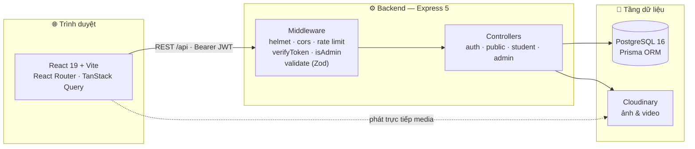
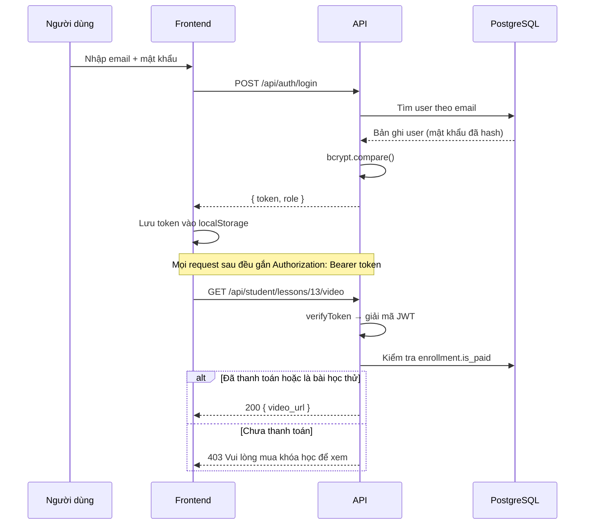
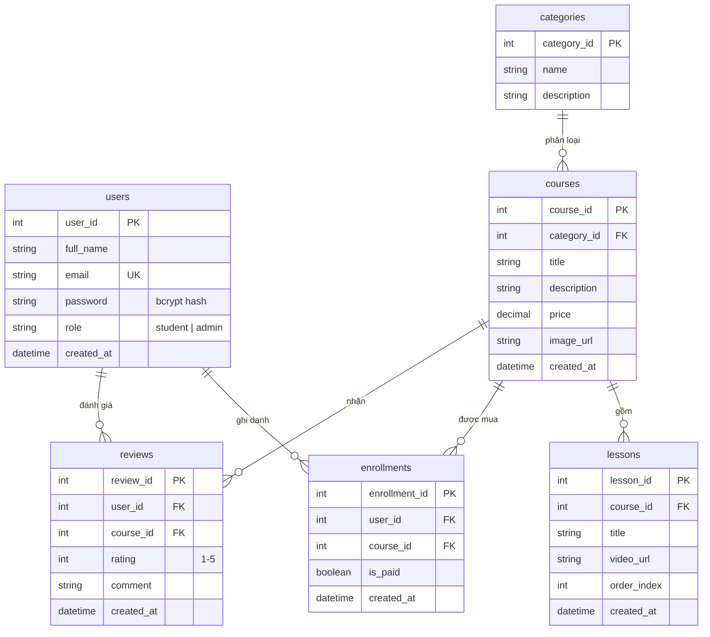

<div align="center">

# 📚 OnlineCourse — Nền tảng học trực tuyến

Ứng dụng web fullstack cho phép học viên khám phá, mua và học các khoá học qua video,
đồng thời cung cấp bảng điều khiển quản trị đầy đủ cho việc vận hành nội dung.

**Đồ án Lập trình Web — Học viện Công nghệ Bưu chính Viễn thông (PTIT)**

[](https://github.com/nguyenvandang2201/BTL-LTWEB-PTIT/actions/workflows/ci.yml)
[](LICENSE)
[](https://nodejs.org)
[](https://react.dev)
[](https://expressjs.com)
[](https://www.prisma.io)
[](https://www.postgresql.org)

[Tính năng](#-tính-năng) • [Kiến trúc](#-kiến-trúc) • [Bắt đầu nhanh](#-bắt-đầu-nhanh) • [Tài liệu API](docs/API.md) • [Đóng góp](CONTRIBUTING.md)

</div>

---

## 📖 Giới thiệu

OnlineCourse là hệ thống học trực tuyến hoàn chỉnh gồm hai phần độc lập:

- **Backend** — REST API xây dựng bằng Node.js, Express 5 và Prisma ORM trên PostgreSQL,
  xác thực bằng JWT, validate đầu vào bằng Zod và lưu trữ media trên Cloudinary.
- **Frontend** — Ứng dụng SPA React 19 + Vite, định tuyến bằng React Router, quản lý
  trạng thái dữ liệu server bằng TanStack Query và giao diện dựng bằng Tailwind CSS.

Điểm nhấn kỹ thuật:

| | |
| --- | --- |
| 🔐 **Phân quyền hai tầng** | Middleware xác thực JWT bảo vệ nhóm route học viên; nhóm route quản trị có thêm middleware kiểm tra vai trò `admin`. |
| 🎬 **Kiểm soát nội dung trả phí** | Hai bài giảng đầu tiên cho học thử; từ bài thứ ba, `video_url` bị loại khỏi response nếu người dùng chưa thanh toán — chặn ngay ở tầng API, không chỉ ẩn trên giao diện. |
| 🔍 **Tìm kiếm mờ tiếng Việt** | Dùng `unaccent` + `pg_trgm` của PostgreSQL để tìm được cả khi gõ thiếu dấu hoặc sai chính tả nhẹ, tự động fallback sang `LIKE` nếu extension không khả dụng. |
| 🛡️ **Cấu hình an toàn từ đầu** | Biến môi trường được xác thực bằng Zod ngay lúc khởi động — thiếu hoặc sai cấu hình thì server dừng ngay kèm thông báo rõ ràng, thay vì lỗi mơ hồ giữa runtime. |
| ♻️ **Vận hành ổn định** | Rate limiting theo IP, nén response, log HTTP, health check và graceful shutdown đóng sạch connection pool. |

---

## ✨ Tính năng

<table>
<tr>
<th width="33%">👤 Khách truy cập</th>
<th width="33%">🎓 Học viên</th>
<th width="33%">🛠️ Quản trị viên</th>
</tr>
<tr valign="top">
<td>

- Xem danh mục khoá học
- Duyệt danh sách khoá học
- Tìm kiếm mờ theo tiêu đề
- Lọc theo danh mục
- Xem chi tiết khoá học
- Học thử 2 bài đầu miễn phí
- Đăng ký / đăng nhập

</td>
<td>

- Mua khoá học
- Xem video bài giảng đầy đủ
- Quản lý "Khoá học của tôi"
- Đánh giá khoá học đã mua
- Cập nhật hồ sơ cá nhân
- Đổi mật khẩu

</td>
<td>

- CRUD danh mục
- CRUD khoá học (upload ảnh bìa)
- CRUD bài giảng (upload video)
- Quản lý danh sách học viên
- Xem chi tiết từng học viên
- Dashboard khoá học bán chạy
- Kiểm duyệt / xoá đánh giá

</td>
</tr>
</table>

---

## 🏗 Kiến trúc



### Luồng xác thực và phân quyền



---

## 🧰 Công nghệ sử dụng

### Backend

| Thư viện | Vai trò |
| --- | --- |
| `express` 5 | HTTP framework |
| `@prisma/client` + `@prisma/adapter-pg` | ORM và driver adapter PostgreSQL |
| `pg` | Connection pool PostgreSQL |
| `jsonwebtoken` | Phát hành và xác thực JWT |
| `bcrypt` | Băm mật khẩu |
| `zod` | Validate request body và biến môi trường |
| `helmet` | HTTP security headers |
| `cors` | Kiểm soát origin được phép gọi API |
| `express-rate-limit` | Giới hạn tần suất request theo IP |
| `compression` | Nén response gzip/brotli |
| `morgan` | Ghi log HTTP request |
| `multer` + `multer-storage-cloudinary` | Nhận và đẩy file lên Cloudinary |

### Frontend

| Thư viện | Vai trò |
| --- | --- |
| `react` 19 + `vite` | Thư viện UI và công cụ build |
| `react-router-dom` | Định tuyến phía client |
| `@tanstack/react-query` | Fetch, cache và đồng bộ dữ liệu server |
| `axios` | HTTP client với interceptor gắn token |
| `tailwindcss` 4 | Hệ thống style utility-first |
| `lucide-react` | Bộ icon |

---

## 📂 Cấu trúc dự án

```text
BTL-LTWEB-PTIT/
├── .github/
│   ├── ISSUE_TEMPLATE/           # Mẫu báo lỗi và đề xuất tính năng
│   └── workflows/ci.yml          # Pipeline CI: lint, migrate, seed, build
├── backend/
│   ├── prisma/
│   │   ├── migrations/           # Lịch sử migration cơ sở dữ liệu
│   │   ├── schema.prisma         # Định nghĩa mô hình dữ liệu
│   │   └── seed.js               # Script nạp dữ liệu mẫu (idempotent)
│   ├── src/
│   │   ├── config/               # env, prisma, cloudinary
│   │   ├── controllers/          # auth, public, student, admin
│   │   ├── middlewares/          # auth, role, validate, rateLimit, error
│   │   ├── routes/               # Định nghĩa endpoint theo nhóm
│   │   ├── schemas/              # Schema Zod cho request body
│   │   ├── app.js                # Cấu hình Express (không listen)
│   │   └── index.js              # Bootstrap server + graceful shutdown
│   ├── .env.example
│   └── postman_collection.json
├── frontend/
│   ├── src/
│   │   ├── components/           # Component dùng chung
│   │   ├── context/              # AuthProvider, context, hook useAuth
│   │   ├── layouts/              # Layout cho khách và cho admin
│   │   ├── pages/                # Trang theo route
│   │   ├── routes/               # Route guard theo vai trò
│   │   ├── services/             # Lớp gọi API
│   │   └── utils/                # axiosInstance và tiện ích chung
│   └── .env.example
├── docs/
│   ├── API.md                    # Tài liệu API đầy đủ
│   └── rag-chatbot-plan.md       # Kế hoạch tích hợp chatbot RAG
├── docker-compose.yml            # PostgreSQL cho môi trường phát triển
└── package.json                  # Script điều phối toàn bộ workspace
```

---

## 🚀 Bắt đầu nhanh

### Yêu cầu

- **Node.js** ≥ 18.18 (khuyến nghị 22 — xem [`.nvmrc`](.nvmrc))
- **npm** ≥ 9
- **PostgreSQL** ≥ 14 (hoặc Docker để dùng `docker-compose.yml` có sẵn)
- Tài khoản **Cloudinary** *(tuỳ chọn — chỉ cần khi dùng chức năng upload thật)*

### Cài đặt

```bash
# 1. Clone repository
git clone https://github.com/nguyenvandang2201/BTL-LTWEB-PTIT.git
cd BTL-LTWEB-PTIT

# 2. Cài dependencies cho cả backend và frontend
npm run setup

# 3. Tạo file cấu hình từ mẫu
cp backend/.env.example backend/.env
cp frontend/.env.example frontend/.env

# 4. Sinh JWT_SECRET ngẫu nhiên rồi dán vào backend/.env
node -e "console.log(require('crypto').randomBytes(48).toString('base64url'))"

# 5. Khởi động PostgreSQL bằng Docker (bỏ qua nếu đã có sẵn PostgreSQL)
npm run db:up

# 6. Áp dụng migration và nạp dữ liệu mẫu
npm run db:migrate
npm run db:seed

# 7. Chạy đồng thời backend + frontend
npm run dev
```

| Dịch vụ      | Địa chỉ                             |
| ------------ | ----------------------------------- |
| Frontend     | http://localhost:5173               |
| Backend API  | http://localhost:5000/api           |
| Health check | http://localhost:5000/api/health    |

### Tài khoản mẫu

Sau khi chạy `npm run db:seed`:

| Vai trò        | Email                   | Mật khẩu       |
| -------------- | ----------------------- | -------------- |
| Quản trị viên  | `admin@ptit.edu.vn`     | `Admin@123`    |
| Học viên       | `an.nguyen@ptit.edu.vn` | `Student@123`  |
| Học viên       | `binh.tran@ptit.edu.vn` | `Student@123`  |

> ⚠️ Đây là tài khoản dành riêng cho môi trường phát triển. Hãy đổi mật khẩu hoặc
> xoá bỏ trước khi triển khai lên production.

---

## ⚙️ Biến môi trường

### `backend/.env`

| Biến                        | Bắt buộc | Mặc định                 | Mô tả                                                     |
| --------------------------- | :------: | ------------------------ | --------------------------------------------------------- |
| `NODE_ENV`                  | ❌       | `development`            | `development` \| `test` \| `production`                   |
| `PORT`                      | ❌       | `5000`                   | Cổng HTTP của backend                                     |
| `DATABASE_URL`              | ✅       | —                        | Chuỗi kết nối PostgreSQL                                  |
| `JWT_SECRET`                | ✅       | —                        | Khoá ký JWT, **tối thiểu 32 ký tự**                       |
| `JWT_EXPIRES_IN`            | ❌       | `1d`                     | Thời hạn token                                            |
| `CORS_ORIGIN`               | ❌       | `http://localhost:5173`  | Danh sách origin hợp lệ, phân tách bằng dấu phẩy          |
| `RATE_LIMIT_WINDOW_MINUTES` | ❌       | `15`                     | Độ dài cửa sổ rate limit (phút)                           |
| `RATE_LIMIT_MAX`            | ❌       | `300`                    | Số request tối đa mỗi IP trong một cửa sổ                 |
| `CLOUDINARY_CLOUD_NAME`     | ❌       | —                        | Chỉ cần khi dùng upload ảnh/video                         |
| `CLOUDINARY_API_KEY`        | ❌       | —                        | Chỉ cần khi dùng upload ảnh/video                         |
| `CLOUDINARY_API_SECRET`     | ❌       | —                        | Chỉ cần khi dùng upload ảnh/video                         |

Toàn bộ biến được xác thực bằng Zod trong [`backend/src/config/env.js`](backend/src/config/env.js).
Nếu cấu hình thiếu hoặc sai, server dừng ngay khi khởi động kèm danh sách lỗi cụ thể.

### `frontend/.env`

| Biến            | Bắt buộc | Mặc định                     | Mô tả                     |
| --------------- | :------: | ---------------------------- | ------------------------- |
| `VITE_API_URL`  | ❌       | `http://localhost:5000/api`  | URL gốc của backend API   |

---

## 🗄 Mô hình dữ liệu



---

## 🔌 API

Base URL: `http://localhost:5000/api`

| Nhóm      | Endpoint tiêu biểu                                                        | Yêu cầu           |
| --------- | ------------------------------------------------------------------------- | ----------------- |
| Hệ thống  | `GET /health`                                                             | —                 |
| Auth      | `POST /auth/register` · `POST /auth/login`                                | —                 |
| Public    | `GET /categories` · `GET /courses` · `GET /courses/:id`                   | —                 |
| Student   | `POST /student/enroll` · `GET /student/lessons/:id/video` · `GET /student/my-courses` | Bearer token |
| Admin     | `POST /admin/courses` · `POST /admin/lessons` · `GET /admin/students`     | Bearer token + `admin` |

📘 **Tài liệu chi tiết** (tham số, body, mã lỗi, ví dụ response): [`docs/API.md`](docs/API.md)

🧪 **Thử nhanh bằng Postman**: import [`backend/postman_collection.json`](backend/postman_collection.json)

---

## 📜 Scripts

Chạy từ **thư mục gốc**:

| Lệnh                  | Mô tả                                              |
| --------------------- | -------------------------------------------------- |
| `npm run setup`       | Cài dependencies cho cả backend và frontend        |
| `npm run dev`         | Chạy song song backend + frontend                  |
| `npm run dev:backend` | Chỉ chạy backend                                   |
| `npm run dev:frontend`| Chỉ chạy frontend                                  |
| `npm run build`       | Build frontend bản production                      |
| `npm run lint`        | Lint toàn bộ mã nguồn                              |
| `npm run lint:fix`    | Lint và tự sửa những lỗi có thể sửa                |
| `npm run db:up`       | Khởi động PostgreSQL bằng Docker                   |
| `npm run db:down`     | Dừng container PostgreSQL                          |
| `npm run db:migrate`  | Áp dụng migration                                  |
| `npm run db:seed`     | Nạp dữ liệu mẫu                                    |
| `npm run db:studio`   | Mở Prisma Studio để xem/sửa dữ liệu trực quan      |

Backend còn có `npm run prisma:deploy` (áp dụng migration ở production) và
`npm run prisma:generate` (sinh lại Prisma Client).

---

## 🔒 Bảo mật

| Hạng mục          | Cách xử lý                                                              |
| ----------------- | ----------------------------------------------------------------------- |
| Mật khẩu          | Băm bằng `bcrypt`, 10 vòng salt                                          |
| Token             | JWT ký HS256, bắt buộc secret ≥ 32 ký tự, mặc định hết hạn 1 ngày        |
| Phân quyền        | `verifyToken` cho nhóm student; thêm `isAdmin` cho toàn bộ nhóm admin    |
| Validate đầu vào  | Schema Zod cho toàn bộ request body                                      |
| HTTP headers      | `helmet` với chính sách cross-origin phù hợp cho media                   |
| CORS              | Whitelist origin qua `CORS_ORIGIN`, mặc định chỉ chấp nhận frontend local|
| Rate limiting     | 300 req/15 phút cho `/api`; 20 req/15 phút cho `/api/auth`               |
| Rò rỉ thông tin   | Stack trace chỉ xuất hiện ở môi trường non-production                    |
| Quản lý secret    | `.env` bị loại khỏi Git; mẫu cấu hình nằm ở `.env.example`               |

Xem thêm checklist trước khi triển khai tại [SECURITY.md](SECURITY.md).

---

## 🗺 Định hướng phát triển

- [ ] Theo dõi tiến độ học tập của từng bài giảng
- [ ] Tích hợp cổng thanh toán thật (VNPay / MoMo)
- [ ] Chatbot AI hỗ trợ học viên theo nội dung bài giảng — [kế hoạch chi tiết](docs/rag-chatbot-plan.md)
- [ ] Bổ sung unit test và integration test (Vitest + Supertest)
- [ ] Sinh tài liệu OpenAPI/Swagger tự động từ schema Zod
- [ ] Refresh token và cơ chế thu hồi token

---

## 🤝 Đóng góp

Mọi đóng góp đều được hoan nghênh. Vui lòng đọc [CONTRIBUTING.md](CONTRIBUTING.md)
để nắm quy ước nhánh, quy ước commit và quy trình pull request.

---

## 📄 Giấy phép

Dự án được phát hành theo giấy phép [MIT](LICENSE).

---

## 👤 Tác giả

**Nguyễn Văn Đăng** — Học viện Công nghệ Bưu chính Viễn thông (PTIT)

- GitHub: [@nguyenvandang2201](https://github.com/nguyenvandang2201)

<div align="center">

⭐ Nếu dự án hữu ích với bạn, hãy để lại một star nhé!

</div>
