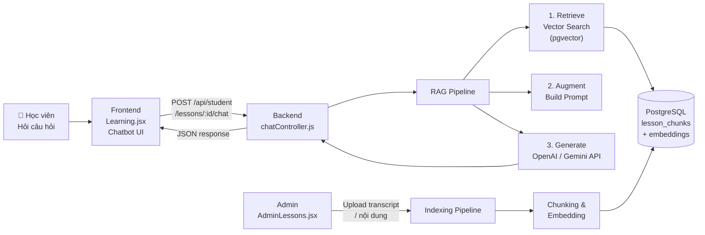
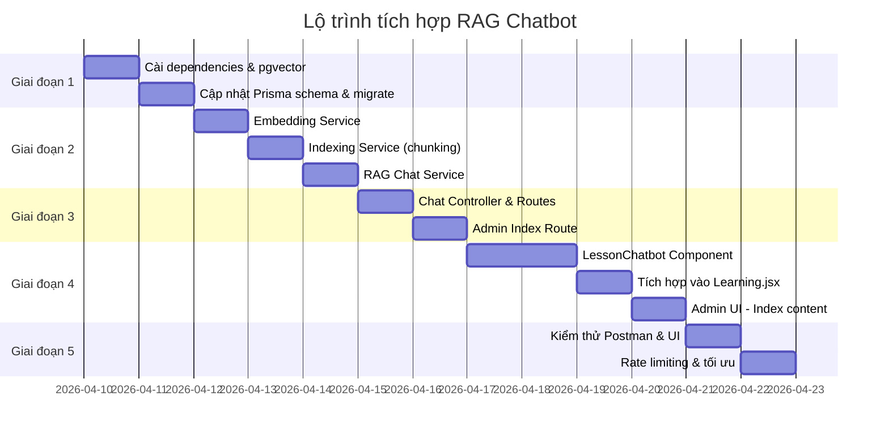

# Kế hoạch Tích hợp Chatbot AI (RAG) vào Bài Giảng

## Bối cảnh dự án

| Thành phần | Công nghệ |
|---|---|
| **Backend** | Express.js 5, Prisma ORM, PostgreSQL, JWT Auth |
| **Frontend** | React + Vite, React Query, React Router |
| **DB hiện tại** | `users`, `courses`, `lessons`, `enrollments`, `reviews` |
| **Storage** | Cloudinary (ảnh/video đã có) |
| **Route bài học** | `GET /api/student/lessons/:id/video` (yêu cầu JWT) |
| **Trang học** | `frontend/src/pages/Learning.jsx` |

> [!IMPORTANT]
> Chatbot chỉ khả dụng với **học viên đã mua khóa học** (`enrollment.is_paid = true`), tương tự logic kiểm soát quyền truy cập video hiện tại.

---

## Tổng quan Kiến trúc RAG



---

## Giai đoạn 1 — Chuẩn bị & Kiến trúc

**Mục tiêu**: Thiết lập hạ tầng lưu trữ vector và chiến lược lấy nội dung bài giảng.

### Bước 1.1 — Cài đặt Dependencies Backend

```bash
# Trong thư mục backend/
npm install openai          # hoặc @google/generative-ai nếu dùng Gemini
npm install @xenova/transformers  # embedding cục bộ (tùy chọn)
npm install langchain @langchain/openai  # RAG orchestration
npm install pdf-parse       # nếu hỗ trợ upload PDF transcript
```

### Bước 1.2 — Kích hoạt pgvector trên PostgreSQL

```sql
-- Chạy migration SQL hoặc thêm vào seed script
CREATE EXTENSION IF NOT EXISTS vector;
```

### Bước 1.3 — Cập nhật Prisma Schema

#### [MODIFY] `backend/prisma/schema.prisma`

Thêm 2 model mới vào schema:

```prisma
// Nội dung bài giảng được chia nhỏ để index (chunk)
model LessonChunk {
  chunk_id    Int      @id @default(autoincrement())
  lesson_id   Int
  content     String   // Đoạn văn bản gốc (transcript/mô tả)
  embedding   Unsupported("vector(1536)")?  // OpenAI ada-002 dimension
  chunk_index Int      // Thứ tự chunk trong bài
  created_at  DateTime @default(now())
  lesson      Lesson   @relation(fields: [lesson_id], references: [lesson_id], onDelete: Cascade)

  @@map("lesson_chunks")
}

// Lịch sử hội thoại chatbot theo từng lesson
model ChatMessage {
  message_id  Int      @id @default(autoincrement())
  user_id     Int
  lesson_id   Int
  role        String   // "user" | "assistant"
  content     String
  created_at  DateTime @default(now())
  user        User     @relation(fields: [user_id], references: [user_id])
  lesson      Lesson   @relation(fields: [lesson_id], references: [lesson_id])

  @@map("chat_messages")
}
```

Thêm relation ngược vào `Lesson`:
```prisma
model Lesson {
  // ... các field hiện tại ...
  chunks       LessonChunk[]
  chatMessages ChatMessage[]
}
```

### Bước 1.4 — Chạy Prisma Migration

```bash
npx prisma migrate dev --name add_rag_chatbot
npx prisma generate
```

### Bước 1.5 — Cấu hình biến môi trường

#### [MODIFY] `backend/.env`

```env
# AI Provider (chọn một)
OPENAI_API_KEY=sk-...
GOOGLE_GEMINI_API_KEY=...

# Embedding model
EMBEDDING_MODEL=text-embedding-ada-002

# Chat model
CHAT_MODEL=gpt-4o-mini

# Số chunks tìm kiếm (top-k)
RAG_TOP_K=5
```

---

## Giai đoạn 2 — Xây dựng RAG Pipeline (Backend)

**Mục tiêu**: Tạo module indexing (nạp nội dung vào vector store) và retrieval (tìm kiếm ngữ nghĩa).

### Bước 2.1 — Tạo Embedding Service

#### [NEW] `backend/src/services/embeddingService.js`

```javascript
import OpenAI from 'openai';

const openai = new OpenAI({ apiKey: process.env.OPENAI_API_KEY });

/**
 * Tạo embedding vector cho một đoạn văn bản.
 * @param {string} text - Văn bản đầu vào
 * @returns {number[]} Vector 1536 chiều
 */
export async function createEmbedding(text) {
  const response = await openai.embeddings.create({
    model: process.env.EMBEDDING_MODEL || 'text-embedding-ada-002',
    input: text.replace(/\n/g, ' '),
  });
  return response.data[0].embedding;
}

/**
 * Tìm top-k chunks gần nhất bằng cosine similarity (pgvector).
 * @param {number[]} queryEmbedding - Vector câu hỏi
 * @param {number} lessonId - Lọc theo bài học
 * @param {number} topK - Số kết quả trả về
 */
export async function searchSimilarChunks(queryEmbedding, lessonId, topK = 5) {
  // Raw SQL vì Prisma chưa hỗ trợ vector natively
  const vectorStr = `[${queryEmbedding.join(',')}]`;
  const results = await prisma.$queryRaw`
    SELECT chunk_id, content, chunk_index,
           1 - (embedding <=> ${vectorStr}::vector) AS similarity
    FROM lesson_chunks
    WHERE lesson_id = ${lessonId}
    ORDER BY embedding <=> ${vectorStr}::vector
    LIMIT ${topK}
  `;
  return results;
}
```

### Bước 2.2 — Tạo Indexing Service

#### [NEW] `backend/src/services/indexingService.js`

```javascript
import prisma from '../config/prisma.js';
import { createEmbedding } from './embeddingService.js';

const CHUNK_SIZE = 500;     // ký tự mỗi chunk
const CHUNK_OVERLAP = 50;   // ký tự overlap giữa các chunk

/**
 * Chia văn bản thành các chunk với overlap.
 */
function chunkText(text, size = CHUNK_SIZE, overlap = CHUNK_OVERLAP) {
  const chunks = [];
  let start = 0;
  while (start < text.length) {
    chunks.push(text.slice(start, start + size));
    start += size - overlap;
  }
  return chunks;
}

/**
 * Index nội dung bài học vào vector store.
 * Xóa chunks cũ → tạo chunks mới → embed → lưu.
 * 
 * @param {number} lessonId
 * @param {string} content - Transcript hoặc mô tả bài học
 */
export async function indexLesson(lessonId, content) {
  // 1. Xóa chunks cũ của bài học này
  await prisma.lessonChunk.deleteMany({ where: { lesson_id: lessonId } });

  // 2. Chia thành chunks
  const chunks = chunkText(content);

  // 3. Embed từng chunk và lưu vào DB
  for (let i = 0; i < chunks.length; i++) {
    const embedding = await createEmbedding(chunks[i]);
    const vectorStr = `[${embedding.join(',')}]`;

    await prisma.$executeRaw`
      INSERT INTO lesson_chunks (lesson_id, content, embedding, chunk_index, created_at)
      VALUES (${lessonId}, ${chunks[i]}, ${vectorStr}::vector, ${i}, NOW())
    `;
  }

  return { chunksIndexed: chunks.length };
}
```

### Bước 2.3 — Tạo RAG Chat Service

#### [NEW] `backend/src/services/ragService.js`

```javascript
import OpenAI from 'openai';
import { createEmbedding, searchSimilarChunks } from './embeddingService.js';

const openai = new OpenAI({ apiKey: process.env.OPENAI_API_KEY });

/**
 * Thực thi RAG pipeline: Retrieve → Augment → Generate.
 *
 * @param {string} question - Câu hỏi của học viên
 * @param {number} lessonId - ID bài học hiện tại
 * @param {Array} chatHistory - Lịch sử hội thoại [{role, content}]
 * @returns {string} Câu trả lời từ AI
 */
export async function ragChat(question, lessonId, chatHistory = []) {
  // 1. RETRIEVE — Tìm chunks liên quan
  const queryEmbedding = await createEmbedding(question);
  const topK = parseInt(process.env.RAG_TOP_K) || 5;
  const relevantChunks = await searchSimilarChunks(queryEmbedding, lessonId, topK);

  // 2. AUGMENT — Xây dựng context từ chunks tìm được
  const context = relevantChunks
    .map((c, i) => `[Đoạn ${i + 1}]: ${c.content}`)
    .join('\n\n');

  // 3. GENERATE — Gọi LLM với prompt đã bổ sung context
  const systemPrompt = `Bạn là trợ lý học tập AI thông minh, chuyên trả lời câu hỏi về nội dung bài giảng.
Hãy trả lời dựa trên NGỮ CẢNH BÀI GIẢNG bên dưới. Nếu câu hỏi không liên quan đến nội dung bài học, hãy thông báo lịch sự.
Trả lời bằng tiếng Việt, ngắn gọn và dễ hiểu.

--- Nội dung bài giảng liên quan ---
${context}
--- Hết nội dung ---`;

  const messages = [
    { role: 'system', content: systemPrompt },
    ...chatHistory.slice(-6), // Giữ 3 lượt hội thoại gần nhất
    { role: 'user', content: question },
  ];

  const completion = await openai.chat.completions.create({
    model: process.env.CHAT_MODEL || 'gpt-4o-mini',
    messages,
    temperature: 0.3,
    max_tokens: 800,
  });

  return completion.choices[0].message.content;
}
```

---

## Giai đoạn 3 — Xây dựng API Chatbot (Backend)

**Mục tiêu**: Thêm các endpoint REST cho chat và admin indexing, tích hợp vào Express app.

### Bước 3.1 — Tạo Chat Controller

#### [NEW] `backend/src/controllers/chatController.js`

```javascript
import prisma from '../config/prisma.js';
import { ragChat } from '../services/ragService.js';
import { indexLesson } from '../services/indexingService.js';

/**
 * @route POST /api/student/lessons/:id/chat
 * @desc  Gửi câu hỏi và nhận câu trả lời từ chatbot RAG.
 * @access Private — yêu cầu JWT + enrollment is_paid
 */
export const chatWithLesson = async (req, res) => {
  try {
    const lessonId = parseInt(req.params.id);
    const userId = req.user.userId;
    const { message } = req.body;

    if (!message?.trim()) {
      return res.status(400).json({ message: 'Vui lòng nhập câu hỏi.' });
    }

    // Kiểm tra quyền truy cập (giống getLessonVideo)
    const lesson = await prisma.lesson.findUnique({ where: { lesson_id: lessonId } });
    if (!lesson) return res.status(404).json({ message: 'Không tìm thấy bài học.' });

    const firstTwo = await prisma.lesson.findMany({
      where: { course_id: lesson.course_id },
      orderBy: { order_index: 'asc' },
      take: 2,
      select: { lesson_id: true },
    });
    const isFree = firstTwo.some((l) => l.lesson_id === lessonId);

    if (!isFree) {
      const enrollment = await prisma.enrollment.findFirst({
        where: { user_id: userId, course_id: lesson.course_id, is_paid: true },
      });
      if (!enrollment) {
        return res.status(403).json({ message: 'Vui lòng mua khóa học để dùng tính năng này.' });
      }
    }

    // Lấy lịch sử hội thoại gần nhất (6 tin nhắn)
    const history = await prisma.chatMessage.findMany({
      where: { user_id: userId, lesson_id: lessonId },
      orderBy: { created_at: 'desc' },
      take: 6,
    });
    const chatHistory = history.reverse().map((m) => ({ role: m.role, content: m.content }));

    // Chạy RAG pipeline
    const answer = await ragChat(message, lessonId, chatHistory);

    // Lưu lịch sử hội thoại
    await prisma.chatMessage.createMany({
      data: [
        { user_id: userId, lesson_id: lessonId, role: 'user', content: message },
        { user_id: userId, lesson_id: lessonId, role: 'assistant', content: answer },
      ],
    });

    return res.status(200).json({ answer });
  } catch (error) {
    console.error('[chatWithLesson]', error);
    return res.status(500).json({ message: 'Lỗi máy chủ', error: error.message });
  }
};

/**
 * @route GET /api/student/lessons/:id/chat/history
 * @desc  Lấy lịch sử chat của học viên cho bài học.
 * @access Private — yêu cầu JWT
 */
export const getChatHistory = async (req, res) => {
  try {
    const lessonId = parseInt(req.params.id);
    const userId = req.user.userId;
    const messages = await prisma.chatMessage.findMany({
      where: { user_id: userId, lesson_id: lessonId },
      orderBy: { created_at: 'asc' },
    });
    return res.status(200).json(messages);
  } catch (error) {
    return res.status(500).json({ message: 'Lỗi máy chủ', error: error.message });
  }
};

/**
 * @route POST /api/admin/lessons/:id/index
 * @desc  Admin nạp/cập nhật nội dung bài học vào vector store.
 * @access Private — Admin only
 */
export const indexLessonContent = async (req, res) => {
  try {
    const lessonId = parseInt(req.params.id);
    const { content } = req.body; // Transcript hoặc mô tả đầy đủ

    if (!content?.trim()) {
      return res.status(400).json({ message: 'Vui lòng cung cấp nội dung bài học.' });
    }

    const result = await indexLesson(lessonId, content);
    return res.status(200).json({ message: 'Index thành công!', ...result });
  } catch (error) {
    console.error('[indexLessonContent]', error);
    return res.status(500).json({ message: 'Lỗi máy chủ', error: error.message });
  }
};
```

### Bước 3.2 — Đăng ký Routes

#### [MODIFY] `backend/src/routes/studentRoutes.js`

Thêm 2 route mới:

```javascript
import { chatWithLesson, getChatHistory } from '../controllers/chatController.js';

// Chatbot RAG
router.post('/lessons/:id/chat', verifyToken, chatWithLesson);
router.get('/lessons/:id/chat/history', verifyToken, getChatHistory);
```

#### [MODIFY] `backend/src/routes/adminRoutes.js`

Thêm route indexing:

```javascript
import { indexLessonContent } from '../controllers/chatController.js';

// Admin: Index nội dung bài học cho RAG
router.post('/lessons/:id/index', verifyToken, isAdmin, indexLessonContent);
```

---

## Giai đoạn 4 — Tích hợp UI Chatbot (Frontend)

**Mục tiêu**: Thêm giao diện chatbot nổi (floating chat panel) vào `Learning.jsx`.

### Bước 4.1 — Tạo Service gọi API Chatbot

#### [MODIFY] `frontend/src/services/student.service.js`

Thêm 2 hàm:

```javascript
export const sendChatMessage = (lessonId, message) =>
  apiClient.post(`/student/lessons/${lessonId}/chat`, { message });

export const getChatHistory = (lessonId) =>
  apiClient.get(`/student/lessons/${lessonId}/chat/history`);
```

### Bước 4.2 — Tạo Component Chatbot UI

#### [NEW] `frontend/src/components/LessonChatbot.jsx`

Component chatbot dạng floating panel:

```jsx
import { useState, useRef, useEffect } from 'react';
import { useMutation, useQuery } from '@tanstack/react-query';
import { MessageCircle, X, Send, Bot, User, Loader2 } from 'lucide-react';
import { sendChatMessage, getChatHistory } from '../services/student.service';

export default function LessonChatbot({ lessonId, isPurchased, isFreeLesson }) {
  const [isOpen, setIsOpen] = useState(false);
  const [input, setInput] = useState('');
  const [messages, setMessages] = useState([]);
  const messagesEndRef = useRef(null);

  const canUseChat = isPurchased || isFreeLesson;

  // Tải lịch sử chat khi mở panel
  const { data: history } = useQuery({
    queryKey: ['chat-history', lessonId],
    queryFn: () => getChatHistory(lessonId),
    enabled: isOpen && !!lessonId && canUseChat,
    onSuccess: (res) => {
      const msgs = res?.data || [];
      if (msgs.length > 0) setMessages(msgs.map((m) => ({ role: m.role, content: m.content })));
    },
  });

  const chatMutation = useMutation({
    mutationFn: ({ lessonId, message }) => sendChatMessage(lessonId, message),
    onSuccess: (res) => {
      const answer = res?.data?.answer || 'Xin lỗi, tôi không hiểu câu hỏi này.';
      setMessages((prev) => [...prev, { role: 'assistant', content: answer }]);
    },
    onError: () => {
      setMessages((prev) => [
        ...prev,
        { role: 'assistant', content: '⚠️ Có lỗi xảy ra. Vui lòng thử lại.' },
      ]);
    },
  });

  const handleSend = () => {
    if (!input.trim() || chatMutation.isPending) return;
    const userMsg = input.trim();
    setMessages((prev) => [...prev, { role: 'user', content: userMsg }]);
    setInput('');
    chatMutation.mutate({ lessonId, message: userMsg });
  };

  useEffect(() => {
    messagesEndRef.current?.scrollIntoView({ behavior: 'smooth' });
  }, [messages]);

  return (
    <>
      {/* Floating Toggle Button */}
      <button
        onClick={() => setIsOpen((o) => !o)}
        className="fixed bottom-6 right-6 z-50 w-14 h-14 rounded-full bg-[#8b0000] 
                   hover:bg-[#a01828] text-white shadow-2xl flex items-center justify-center
                   transition-all duration-300 hover:scale-110"
        title="Hỏi AI về bài học này"
      >
        {isOpen ? <X size={22} /> : <MessageCircle size={22} />}
      </button>

      {/* Chat Panel */}
      {isOpen && (
        <div className="fixed bottom-24 right-6 z-50 w-96 max-h-[70vh] flex flex-col
                        bg-zinc-900/95 backdrop-blur-md border border-zinc-700/60 
                        rounded-2xl shadow-2xl overflow-hidden">
          {/* Header */}
          <div className="px-4 py-3 bg-[#8b0000]/30 border-b border-zinc-700/60 flex items-center gap-2">
            <Bot size={18} className="text-[#c0392b]" />
            <div>
              <p className="text-sm font-semibold text-zinc-100">AI Trợ giảng</p>
              <p className="text-xs text-zinc-400">Hỏi về nội dung bài học này</p>
            </div>
          </div>

          {/* Messages */}
          <div className="flex-1 overflow-y-auto p-4 space-y-3 min-h-0">
            {!canUseChat ? (
              <div className="text-center py-8 text-zinc-500 text-sm">
                🔒 Mua khóa học để sử dụng AI trợ giảng
              </div>
            ) : messages.length === 0 ? (
              <div className="text-center py-8 text-zinc-500 text-sm">
                <Bot size={32} className="mx-auto mb-2 opacity-40" />
                Hỏi tôi bất cứ điều gì về bài giảng này!
              </div>
            ) : (
              messages.map((m, i) => (
                <div
                  key={i}
                  className={`flex gap-2 ${m.role === 'user' ? 'flex-row-reverse' : ''}`}
                >
                  <div className={`w-7 h-7 rounded-full flex items-center justify-center shrink-0
                    ${m.role === 'user' ? 'bg-[#8b0000]' : 'bg-zinc-700'}`}>
                    {m.role === 'user' ? <User size={13} /> : <Bot size={13} />}
                  </div>
                  <div className={`max-w-[75%] px-3 py-2 rounded-xl text-sm leading-relaxed
                    ${m.role === 'user'
                      ? 'bg-[#8b0000]/70 text-white rounded-tr-none'
                      : 'bg-zinc-800 text-zinc-200 rounded-tl-none'}`}>
                    {m.content}
                  </div>
                </div>
              ))
            )}
            {chatMutation.isPending && (
              <div className="flex gap-2 items-center text-zinc-400 text-sm">
                <Loader2 size={16} className="animate-spin" />
                AI đang soạn câu trả lời...
              </div>
            )}
            <div ref={messagesEndRef} />
          </div>

          {/* Input */}
          {canUseChat && (
            <div className="p-3 border-t border-zinc-700/60 flex gap-2">
              <input
                type="text"
                value={input}
                onChange={(e) => setInput(e.target.value)}
                onKeyDown={(e) => e.key === 'Enter' && !e.shiftKey && handleSend()}
                placeholder="Nhập câu hỏi về bài học..."
                className="flex-1 bg-zinc-800/60 border border-zinc-700/60 text-zinc-200 
                           placeholder-zinc-500 rounded-lg px-3 py-2 text-sm
                           focus:outline-none focus:ring-2 focus:ring-[#8b0000]"
                disabled={chatMutation.isPending}
              />
              <button
                onClick={handleSend}
                disabled={!input.trim() || chatMutation.isPending}
                className="p-2 bg-[#8b0000] hover:bg-[#a01828] disabled:opacity-40
                           text-white rounded-lg transition-colors"
              >
                <Send size={16} />
              </button>
            </div>
          )}
        </div>
      )}
    </>
  );
}
```

### Bước 4.3 — Nhúng Chatbot vào Learning.jsx

#### [MODIFY] `frontend/src/pages/Learning.jsx`

1. Import component:
```javascript
import LessonChatbot from '../components/LessonChatbot';
```

2. Tính `activeLessonData` để biết lesson hiện tại có phải bài miễn phí không:
```javascript
const activeLessonData = lessons.find((l) => l.lesson_id === activeLesson);
const isActiveFreeLesson = activeLessonData && !activeLessonData.is_locked;
```

3. Thêm component trước thẻ đóng `</div>` cuối cùng:
```jsx
{/* AI Chatbot — chỉ hiện khi có bài đang xem */}
{activeLesson && (
  <LessonChatbot
    lessonId={activeLesson}
    isPurchased={isPurchased}
    isFreeLesson={isActiveFreeLesson}
  />
)}
```

### Bước 4.4 — Trang Admin: Thêm chức năng Index nội dung

#### [MODIFY] `frontend/src/pages/AdminLessons.jsx`

Thêm form nhập transcript và nút "Index cho AI" vào modal chỉnh sửa bài học:

```jsx
{/* Trong modal edit lesson */}
<div>
  <label className="block text-sm text-zinc-400 mb-1.5">
    Nội dung / Transcript (dùng cho AI Chatbot)
  </label>
  <textarea
    value={lessonContent}
    onChange={(e) => setLessonContent(e.target.value)}
    rows={5}
    placeholder="Dán transcript bài giảng hoặc mô tả chi tiết nội dung..."
    className="w-full px-4 py-2.5 bg-zinc-800/60 border border-zinc-700/60 
               text-zinc-200 placeholder-zinc-500 rounded-lg text-sm resize-none 
               focus:outline-none focus:ring-2 focus:ring-[#8b0000]"
  />
</div>
<button
  type="button"
  onClick={() => indexMutation.mutate({ lessonId: editingLesson.lesson_id, content: lessonContent })}
  disabled={indexMutation.isPending || !lessonContent.trim()}
  className="px-4 py-2 bg-indigo-700 hover:bg-indigo-600 disabled:opacity-50 
             text-white text-sm rounded-lg transition-colors flex items-center gap-2"
>
  {indexMutation.isPending ? '🔄 Đang index...' : '🤖 Index cho AI'}
</button>
```

---

## Giai đoạn 5 — Kiểm thử & Triển khai

**Mục tiêu**: Đảm bảo chất lượng và tối ưu trước khi ra mắt.

### Bước 5.1 — Kiểm thử thủ công với Postman

| # | Endpoint | Kịch bản kiểm thử |
|---|---|---|
| 1 | `POST /api/admin/lessons/:id/index` | Index nội dung bài học mẫu |
| 2 | `POST /api/student/lessons/:id/chat` | Hỏi câu hỏi liên quan → kiểm tra câu trả lời |
| 3 | `POST /api/student/lessons/:id/chat` | Hỏi câu hỏi không liên quan → AI từ chối lịch sự |
| 4 | `GET /api/student/lessons/:id/chat/history` | Kiểm tra lịch sử lưu đúng |
| 5 | `POST /api/student/lessons/:id/chat` | Gọi không có JWT → `401` |
| 6 | `POST /api/student/lessons/:id/chat` | Gọi với user chưa mua → `403` |

### Bước 5.2 — Kiểm thử UI Frontend

- [ ] Chatbot button hiển thị khi có bài đang xem
- [ ] Panel mở/đóng mượt mà
- [ ] Gửi câu hỏi và nhận trả lời đúng
- [ ] Lịch sử hội thoại được tải lại khi mở tab mới
- [ ] Hiển thị trạng thái loading trong khi AI đang xử lý
- [ ] Thông báo lock khi chưa mua khóa học

### Bước 5.3 — Tối ưu hiệu suất

**Chi phí API**: Implement caching đơn giản bằng Redis hoặc in-memory để tránh gọi AI với câu hỏi trùng lặp.

**Rate limiting**: Giới hạn số câu hỏi mỗi phút với middleware:
```javascript
// Thêm vào studentRoutes.js
import rateLimit from 'express-rate-limit';

const chatLimiter = rateLimit({
  windowMs: 60 * 1000, // 1 phút
  max: 10,             // tối đa 10 câu/phút
  message: { message: 'Bạn đang hỏi quá nhanh. Vui lòng chờ.' },
});

router.post('/lessons/:id/chat', verifyToken, chatLimiter, chatWithLesson);
```

### Bước 5.4 — Cân nhắc Provider AI (Trade-offs)

| Provider | Ưu điểm | Nhược điểm |
|---|---|---|
| **OpenAI GPT-4o-mini** | Chất lượng cao, dễ tích hợp | Phí cao hơn |
| **Google Gemini 1.5 Flash** | Rẻ, tiếng Việt tốt | API còn mới |
| **Ollama (local)** | Miễn phí, bảo mật | Cần server mạnh |

---

## Tóm tắt Timeline



**Ước tính**: ~10–12 ngày làm việc cho toàn bộ 5 giai đoạn.
